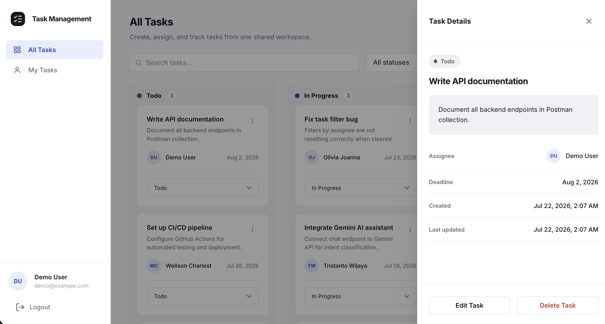
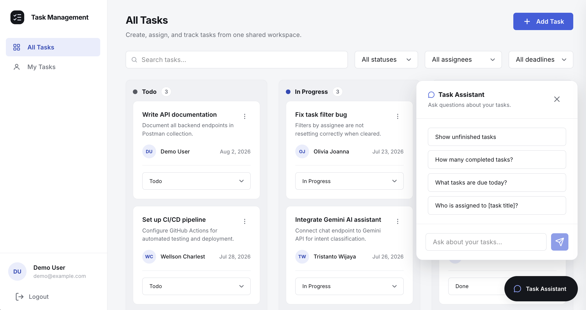

# Task Management App

A full-stack task management application developed for a Front-End and Back-End Developer Internship technical assessment.

The application allows users to authenticate, manage tasks through a Kanban board, assign tasks to team members, and search or filter task data.

## Screenshots

**Kanban Board**


**Login**


**Task Detail Drawer**



**AI Task Assistant**



## Features

- JWT authentication with a seeded demo account
- Kanban board with Todo, In Progress, and Done columns
- Create, view, update, and delete tasks
- Change task status and assignee
- Search tasks by title
- Filter tasks by status, assignee, and deadline
- My Tasks view for the authenticated user
- Task detail drawer
- Interactive FastAPI documentation
- PostgreSQL migrations using Alembic
- Reproducible database seed script
- Optional read-only AI task assistant

## Tech Stack

**Frontend**

- Next.js
- React
- TypeScript
- Tailwind CSS

**Backend**

- FastAPI
- SQLAlchemy
- Alembic
- Pydantic
- JWT authentication

**Database**

- PostgreSQL
- Docker Compose

## Project Structure

```text
task-management-app/
├── backend/
├── frontend/
└── docs/
```

## Prerequisites

- Git
- Python 3.12 (on Debian/Ubuntu, also install the `python3.12-venv` package — see Linux steps below)
- Node.js 20.9 or later — on Debian/Ubuntu, the default `apt` package is older than this; install via [NodeSource](https://github.com/nodesource/distributions) or [nvm](https://github.com/nvm-sh/nvm) instead
- Docker Desktop (Linux: Docker Engine + the Compose plugin) — must be **running** before the steps below

## Running the Project

### Backend

**macOS**

```bash
cd backend
cp .env.example .env
docker compose up -d

python3.12 -m venv .venv
source .venv/bin/activate
python -m pip install -r requirements.txt
python -m alembic upgrade head
python -m app.seed
python -m uvicorn app.main:app --reload
```

**Windows PowerShell**

```powershell
Set-Location backend
Copy-Item .env.example .env
docker compose up -d

py -3.12 -m venv .venv
Set-ExecutionPolicy -Scope Process -ExecutionPolicy Bypass
.\.venv\Scripts\Activate.ps1
python -m pip install -r requirements.txt
python -m alembic upgrade head
python -m app.seed
python -m uvicorn app.main:app --reload
```

> If activation fails with "running scripts is disabled on this system", the `Set-ExecutionPolicy` line above fixes it for the current terminal only — it doesn't change any system-wide setting.

**Linux**

```bash
cd backend
cp .env.example .env
docker compose up -d

sudo apt install -y python3.12 python3.12-venv   # skip if already installed
python3.12 -m venv .venv
source .venv/bin/activate
python -m pip install -r requirements.txt
python -m alembic upgrade head
python -m app.seed
python -m uvicorn app.main:app --reload
```

Runs at `http://localhost:8000` — API docs at `http://localhost:8000/docs`.

> Already have PostgreSQL running locally? Skip `docker compose up -d`, create a dedicated empty database, and point `DATABASE_URL` in `backend/.env` at it before running the migration and seed commands, e.g.:
>
> ```bash
> createdb taskapp_dev
> ```
>
> ```env
> DATABASE_URL=postgresql+psycopg2://<your-pg-user>@localhost:5432/taskapp_dev
> ```

### Frontend

Open a second terminal.

**macOS**

```bash
cd frontend
cp .env.example .env.local
npm install
npm run dev
```

**Windows PowerShell**

```powershell
Set-Location frontend
Copy-Item .env.example .env.local
npm install
npm run dev
```

**Linux**

```bash
cd frontend
cp .env.example .env.local
npm install
npm run dev
```

Runs at `http://localhost:3000` (if that port is already taken, Next.js will pick the next free one, e.g. `3001` — see Troubleshooting below).

## Demo Account

```text
Email: demo@example.com
Password: password123
```

The seed script also creates additional users that can be selected as task assignees.

## Environment Variables

**`backend/.env`**

| Variable | Description |
|---|---|
| `DATABASE_URL` | PostgreSQL connection string |
| `SECRET_KEY` | Secret used to sign JWT tokens |
| `ACCESS_TOKEN_EXPIRE_MINUTES` | Access-token lifetime |
| `CORS_ORIGINS` | Frontend origins allowed to access the backend |
| `ENABLE_AI_CHATBOT` | Enables or disables the AI assistant |
| `GEMINI_API_KEY` | Gemini API key from [Google AI Studio](https://aistudio.google.com/apikey), used when the AI assistant is enabled |

**`frontend/.env.local`**

| Variable | Description |
|---|---|
| `NEXT_PUBLIC_API_BASE_URL` | Backend API base URL, e.g. `http://localhost:8000/api/v1` |

## AI Task Assistant

Optional, read-only, disabled by default. Gemini is used only to classify a question into one of a fixed set of intents — the backend then runs a normal, predefined database query. Gemini never queries the database or generates SQL directly.

Supported questions:
- List incomplete tasks
- Count completed tasks
- List tasks due today
- Get the assignee of a specific task

Get a free key from [Google AI Studio](https://aistudio.google.com/apikey), then set in `backend/.env` and restart the backend:

```env
ENABLE_AI_CHATBOT=true
GEMINI_API_KEY=your-gemini-api-key
```

## Database Commands

Run from `backend/`, with the virtual environment active.

```bash
python -m alembic upgrade head   # apply migrations
python -m app.seed               # reset seed data (clears tasks)
docker compose down              # stop Postgres, keep data
docker compose down -v           # stop Postgres, delete data
```

## Troubleshooting

- **`docker compose up -d` hangs or fails immediately** — Docker Desktop isn't running yet; open it and try again.
- **Migrations or seed fail with an authentication or "database does not exist" error even though the Postgres container is "Up"** — another Postgres (local install or another project) is already using the port the container tries to publish. Check what's listening (`lsof -i :5433` on macOS/Linux, `netstat -ano | findstr 5433` on Windows), then either stop it or change the port in both `backend/docker-compose.yml` and `DATABASE_URL`.
- **Frontend prints `Port 3000 is in use ... using port 3001 instead`** — harmless, but if you changed `CORS_ORIGINS` from its default, make sure it includes whatever port the frontend actually landed on (comma-separated), then restart the backend.
- **Windows: `Activate.ps1 cannot be loaded because running scripts is disabled on this system`** — run `Set-ExecutionPolicy -Scope Process -ExecutionPolicy Bypass` in the same terminal, then activate again.
- **Linux: `python3.12 -m venv` fails with "ensurepip is not available"** — install `python3.12-venv` (`sudo apt install python3.12-venv`), then retry.

## Documentation

- Swagger UI: `http://localhost:8000/docs`
- Postman collection: `docs/postman/`
- ERD: `docs/erd/`
- Planning docs: `docs/planning/`

## Notes

- No user registration — only the seeded demo account can log in.
- The seed script clears existing task data whenever it runs.
- `.env` files are git-ignored and must be created from the provided `.env.example` templates.
